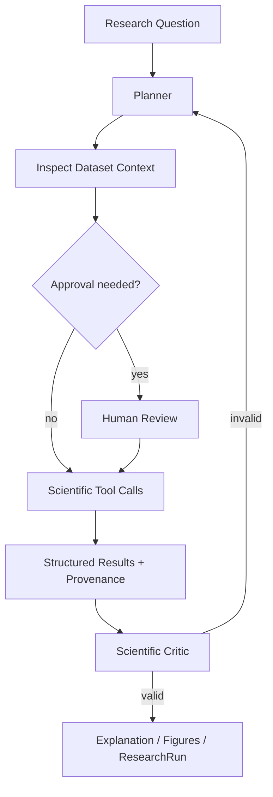

# Agent Workflow Baseline

```mermaid
flowchart TD
    Q[Research Question] --> P[Planner]
    P --> C[Inspect Dataset Context]
    C --> A{Approval needed?}
    A -- yes --> H[Human Review]
    A -- no --> T[Scientific Tool Calls]
    H --> T
    T --> R[Structured Results + Provenance]
    R --> QC[Scientific Critic]
    QC -- invalid --> P
    QC -- valid --> O[Explanation / Figures / ResearchRun]
```

MVP is one orchestrator + tool registry + critic, not a swarm of agents.
