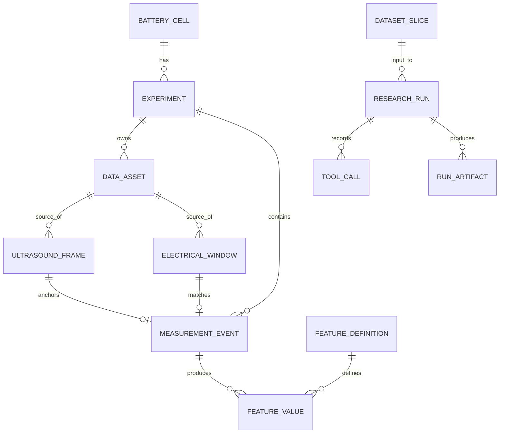

# Database ER — V1.1



The provenance chain for every analyzed point must be recoverable:

```text
Battery
→ Experiment
→ Ultrasound DataAsset + frame index
→ Electrical DataAsset + record index
→ MeasurementEvent
→ feature/model/result
```
