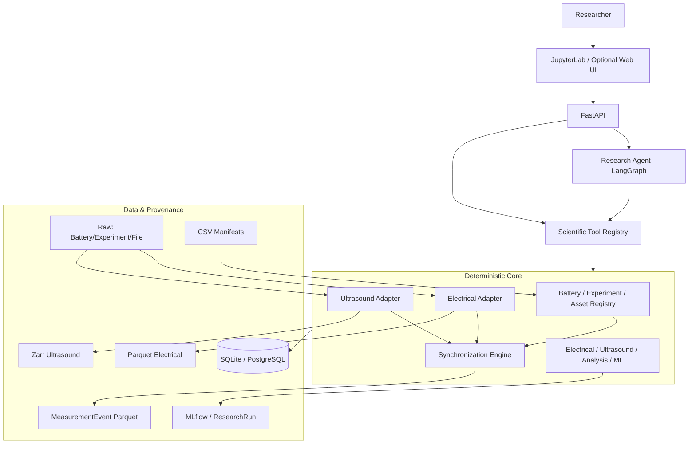

# System Architecture Baseline — V1.1

```mermaid
flowchart TB
    USER[Researcher]
    UI[JupyterLab / Optional Web UI]
    API[FastAPI]
    AGENT[Research Agent - LangGraph]
    TOOLS[Scientific Tool Registry]

    subgraph CORE[Deterministic Core]
      REG[Battery / Experiment / Asset Registry]
      EIO[Electrical Adapter]
      UIO[Ultrasound Adapter]
      SYNC[Synchronization Engine]
      SCI[Electrical / Ultrasound / Analysis / ML]
    end

    subgraph DATA[Data & Provenance]
      RAW[Raw: Battery/Experiment/File]
      MAN[CSV Manifests]
      PARQ[Parquet Electrical]
      ZARR[Zarr Ultrasound]
      EVENTS[MeasurementEvent Parquet]
      DB[(SQLite / PostgreSQL)]
      MLF[MLflow / ResearchRun]
    end

    USER --> UI --> API
    API --> AGENT
    API --> TOOLS
    AGENT --> TOOLS
    TOOLS --> CORE

    MAN --> REG
    RAW --> EIO
    RAW --> UIO
    REG --> SYNC
    EIO --> SYNC
    UIO --> SYNC
    SYNC --> EVENTS

    EIO --> PARQ
    UIO --> ZARR
    CORE --> DB
    SCI --> MLF
```

Architecture invariant:

> Agent determines **what analysis to run**.
> Versioned deterministic scientific modules determine **how results are calculated**.
